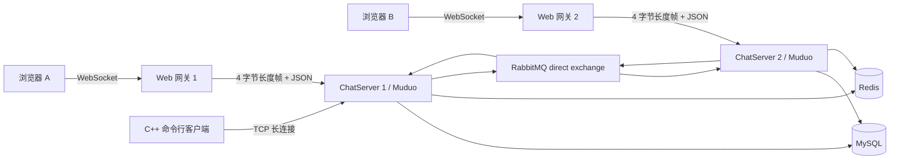
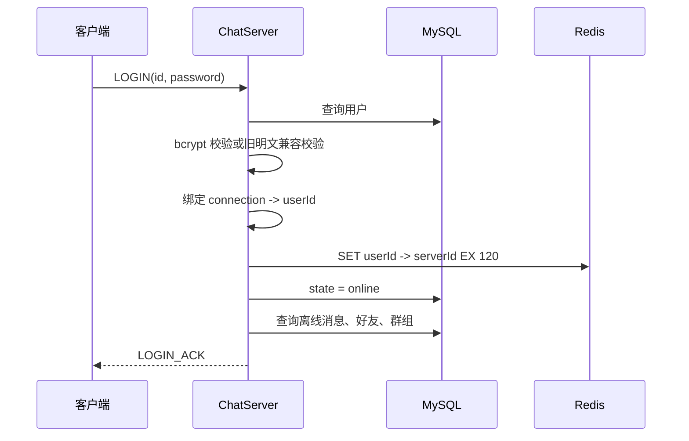
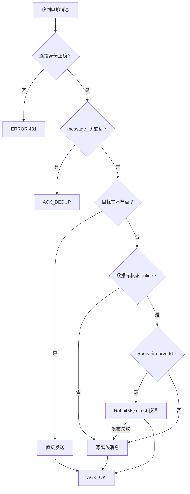

# 文档2：当前项目架构

## 1. 架构概览



项目是“模块化单体 + 外部中间件”，不是微服务。每个 ChatServer 节点包含网络层、业务层和数据访问层。

## 2. 各组件职责

| 组件 | 职责 | 不负责 |
|---|---|---|
| Muduo ChatServer | TCP 连接、拆包、业务分发、本地连接表 | 浏览器协议、持久化队列 |
| ChatService | 登录、注册、关系、群组、聊天、认证、投递策略 | TCP 拆包、网页渲染 |
| MySQL | 用户、好友、群组、离线消息 | 在线路由、短期去重 |
| Redis | 消息去重键、`userId -> serverId` 路由及 TTL | 跨节点消息正文 |
| RabbitMQ | 按 `serverId` 跨节点定向投递 | 用户信息和离线消息 |
| Web 网关 | WebSocket 与 TCP 帧互转、静态文件 | 登录鉴权、业务判断 |
| Web 前端 | 用户交互、ACK 状态、重试、心跳 | 可信身份判断 |

## 3. 分层与源码

```text
include/frameprotocol.hpp        公共帧规则
include/public.hpp               消息类型
include/server/framecodec.hpp    Muduo Buffer 拆帧
src/server/chatserver.cpp        网络入口、JSON校验、超时巡检
src/server/chatservice.cpp       业务与投递策略
src/server/model/                MySQL 数据访问
src/server/redis/                Redis 去重和在线路由
src/server/mq/                   RabbitMQ direct 总线
src/server/security/             bcrypt
src/client/main.cpp              C++ 命令行客户端
web/gateway.mjs                  WebSocket/TCP 适配
web/public/                      浏览器页面
```

## 4. 网络协议

TCP 帧：

```text
+----------------------+--------------------------+
| 4 字节 payload 长度  | UTF-8 JSON payload       |
| 网络字节序 / 大端    | 1 B ～ 4 MB              |
+----------------------+--------------------------+
```

使用长度头而不是分隔符，原因是 JSON 内容可能包含任意字符，长度头也更容易处理粘包和拆包。

主要消息类型：

| 编号 | 类型 | 方向 |
|---:|---|---|
| 1 / 2 | 登录 / 登录响应 | 双向 |
| 3 | 注销 | 客户端→服务端 |
| 4 / 5 | 注册 / 注册响应 | 双向 |
| 6 | 单聊 | 双向 |
| 7 | 添加好友 | 客户端→服务端 |
| 8 / 9 | 创建群 / 加群 | 客户端→服务端 |
| 10 | 群聊 | 双向 |
| 11 | 消息 ACK | 服务端→发送方 |
| 12 / 13 | 心跳 / 心跳响应 | 双向 |
| 14 | 统一错误 | 服务端→客户端 |

## 5. 登录与认证



后续业务消息必须通过 `connection -> userId` 校验，不能只相信 JSON 中的 `id`。

## 6. 单聊投递



ACK 表示服务端已接受并完成当前投递策略，不等于接收方已经阅读。

## 7. 跨节点路由

每个节点有唯一 `CHAT_SERVER_ID`：

1. 登录时向 Redis 写 `chat:user:server:{userId} = serverId`，TTL 120 秒；
2. 心跳每 10 秒刷新该路由；
3. 发送方节点查到目标 `serverId`；
4. RabbitMQ direct exchange 使用 `serverId` 作为 routing key；
5. 目标节点消费后查询本地连接表并发送；若连接刚断开，则写离线库。

RabbitMQ 不保存在线状态，Redis 不转发消息正文，职责保持单一。

## 8. 去重与重试

- 客户端业务消息携带 `message_id`；
- 5 秒未收到 ACK 重发，最多 3 次；
- 服务端先用 Redis `SET NX EX` 做跨节点去重；
- Redis 不可用时回退本地 LRU + TTL；
- 重复消息返回 `ACK_DEDUP`，客户端停止重试。

这是“至少一次发送 + 幂等消费”的简化设计，不是严格 Exactly Once。

## 9. 顺序模型

- 单聊：发送方对每个 `toId` 单独递增 `client_seq`；
- 群聊：发送方对每个 `groupId` 单独递增；
- 接收方按“会话 + 发送者”缓冲乱序消息；
- 序号洞等待 2 秒后跳过，避免永久阻塞。

跨发送者之间没有可比较的全局顺序，这是有意的语义选择。

## 10. 数据表

| 表 | 核心字段 | 用途 |
|---|---|---|
| `user` | id、name、password、state | 账户与状态 |
| `friend` | userid、friendid | 好友关系 |
| `allgroup` | id、groupname、groupdesc | 群组 |
| `groupuser` | groupid、userid、grouprole | 群成员 |
| `offlinemessage` | id、userid、message、created_at | 离线消息 |

## 11. 线程模型

- Muduo：1 个主 EventLoop + 4 个 IO 线程；
- ChatService：单例，共享连接表受互斥锁保护；
- Redis：单同步连接，命令通过互斥锁串行化；
- RabbitMQ：发布连接受互斥锁保护，消费使用独立线程和独立连接；
- C++ 客户端：接收、心跳、重试、顺序冲刷线程；socket 写通过同一互斥锁串行化；
- Web 网关：Node.js 事件循环，每个浏览器连接对应一个后端 TCP 连接。

## 12. 配置

环境变量示例见 `.env.example`。关键项：

- `CHAT_SERVER_ID`
- `CHAT_MYSQL_HOST/PORT/USER/PASSWORD/DATABASE`
- `CHAT_REDIS_HOST/PORT`
- `CHAT_RABBITMQ_HOST/PORT/USER/PASSWORD/EXCHANGE`
- `CHAT_WEB_PORT`
- `CHAT_BACKEND_HOST/PORT`
